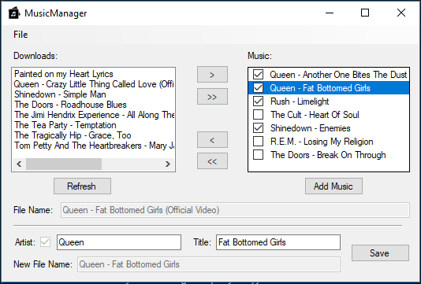

# MusicManager
Parses music files for artist and song name. Sets and saves checked filenames and information in music library with appropriate meta tags.

Features:
  - Downloads/Library Paths
      - Specify the paths of downloads and library directories.
  - Artist Verifaction
      - Verifies if file artists exist, moves songs to correct artist folder or creates a new artist if not found.
  - Blacklists
      - Word Blacklist
          Removes blacklisted words from the filename of files.
      - Character Blacklist
          Removed blacklisted characters from filenames. Includes brackets by default, removing groups.      
  
